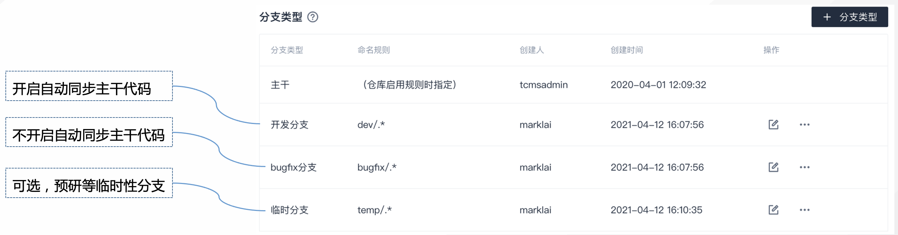
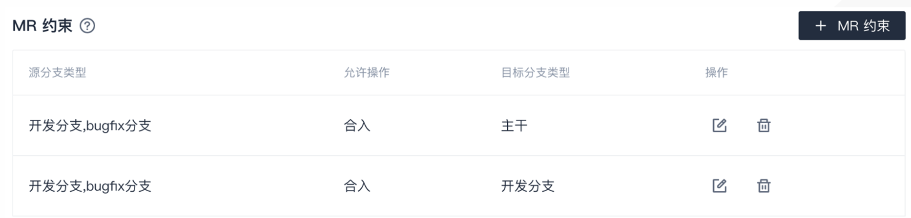
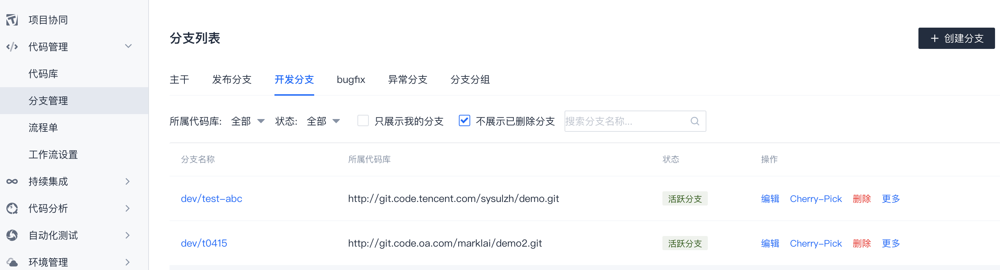

# 前端/后台项目典型规则设置

前端/后台类项目一般只关注最新版本，不会同时维护多个版本，适合采用像 `特性分支/GitHub` 的工作流，即分支开发、主干发布的模式。  

落地到Coding代码管理中，典型分支规则如下所示。

## 分支类型设置

| 分支类型 | 命名规则 | 	设置建议 | 备注 |
| --- | --- | --- | --- |
| 开发分支 | `dev/.*` | 非保护分支，开启分支自动同步、分支自动删除。 | 按团队实情决定是否要求绑定需求单。 |
| Bugfix分支 | `bugfix/.*` | 非保护分支，不开启分支自动同步，开启分支自动删除 | 按团队实情决定是否要求绑定bug单。 |
| 临时分支 | `temp/.*` | 非保护分支，不开启分支自动同步，不开启分支自动删除，不要求绑定TAPD | 非必须，如无使用场景可不建该类型。用于某些预研、临时验证等，并且不允许合入主干（通过 `MR约束` 限制）。 |

## MR约束设置
> 请注意，MR约束要么不配置，如果配置的话需要考虑全面。

* 允许开发分支和bugfix分支合入主干，不允许临时分支合入主干
* 如果其他分支间也有MR的场景，可适当添加规则。

## 分支版本管理设置
前端/后台项目一般不开启分支版本管理，所有分支展示在同一个分支列表中。

