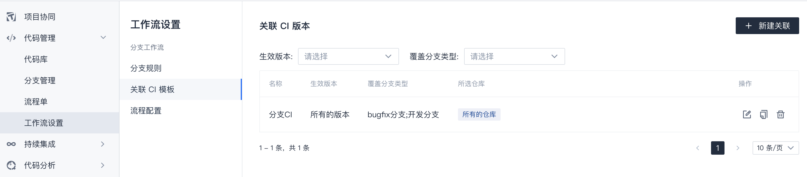

# 关联CI模板

`关联CI模板`的作用在于建立相关仓库的某个或某些分支类型与流水线模板的关联，从而达到拉分支时自动创建流水线的目的。  

流水线信息会记录到分支信息中（在`分支管理`页面可查看）。  

> 作为建立关联的前提之一，您需要有相应的流水线模板，如果还没有，则需要先创建，可参考 [持续集成相关的手册](http://help.coding.pages.oa.com/docs/ci/%E4%BD%BF%E7%94%A8%E6%89%8B%E5%86%8C/%E6%B5%81%E6%B0%B4%E7%BA%BF%E6%A8%A1%E6%9D%BF/pipeline-template.html)。

## 新建CI模板关联
有两种方式可以新建分支类型与CI模板的关联：  
方式一、点击右上方 `+ 新建关联` 按钮。
方式二、点击现有关联右方的 `复制` 按钮，复制后再做调整。

选项说明：  
  - 模板名称：当前关联设置的名称，建议尽量简洁。
  - 选择仓库：对所有启用分支工作流的仓库生效还是只对部分仓库生效。  
  - 适用版本范围：一般选择"所有版本"，也可以选择仅对某个或某几个版本生效。
  - 覆盖分支类型：即哪些分支新建后创建流水线，可以选择一个或多个分支类型。
  - CI平台：创建哪个CI平台的流水线，目前支持`Coding CI`。
  - 是否立即启动：如果启用，则创建流水线之后立即触发一次，即使还没有代码更新。
  - 创建方式：
    - YAML配置：基于YAML定义来创建流水线。此处填写YAML文件在代码库中的相对路径。
    - 已有CI模板配置：从已定义的流水线模板选择，将基于该模板创建流水线。
    - 已有CI任务：选择已存在的流水线。该选择不会创建新流水线，而总是将流水线信息记录到分支详情中，适用于一条流水线监听某个类型所有分支的场景。

    

## 编辑CI模板关联
点击现有关联右方的 `编辑` 按钮进行调整。  

## 删除CI模板关联
点击现有关联右方的 `删除` 按钮进行删除。  

删除关联只是取消了拉相关分支时自动创建流水线的关系，不会影响流水线模板或已有流水线。  

