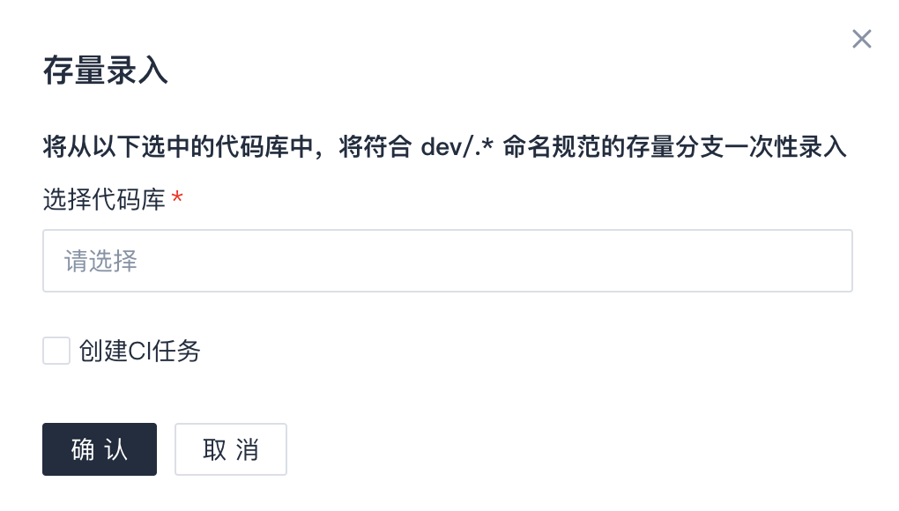

# 分支规则设置
本章介绍的分支规则设置加上关联CI模板、配置分支流程等设置一起构成了`分支工作流`规范，从多方面促进团队建立一致的研发模式。

## 初始化Git工作流
`代码管理`内置了业界常见的一些Git工作流，如GitHub工作流、GitLab工作流（分为持续发布和版本发布两类）等，定义了相关分支类型及命名规则、关联TAPD单的要求、自动同步的设定、MR约束规则等，可通过查看详情了解更多细节。  

对一个新项目来说，您可以选择以内置工作流进行初始化，也可以选择自定义设置，根据需要添加规则。  

> 内置工作流只是提供了一套预设的规则，初始化之后仍然可以就实际情况做规则调整。

操作过程：  
点击`代码管理`/`工作流设置`，未设置过分支工作流的项目会看到预设Git工作流的介绍（已设置过的则会看到相关设置项）。  

这里我们可以决定采用某一个内置工作流进行初始化还是自定义设置（即"使用内置工作流"处选"否"）。

## 查看/设置分支规则
点击`代码管理`/`工作流设置`，在`分支规则`页面可以管理分支类型、MR约束、以及其他一些功能选项。  
### 分支类型
在这里可以定义不同用途的分支类型，命名规范支持正则表达式（例如 `dev/.*`）。每个分支类型可以按实际需要选择启用更多特性。  

分支类型支持排序，靠前的拥有更高优先级，如果多个分支类型的命名规则有重合，则以高优先级的为准。（应避免不同类型出现命名规则重合的情况，否则团队日常使用上容易造成混乱。）

分支类型界面如下所示:

> `主干`是个特殊的类型，不可编辑，并且不在此处指定名称，以代码仓库启用分支工作流时指定的主干为准。

【分支类型选项说明】
* 分支类型名称：团队定义的分支类型，如`开发分支`、`bugfix分支`、`临时分支`等。
* 分支命名规则：定义该类型分支的特征，支持正则表达式，如`dev/.*`、`bugfix/.*`、`temp/.*`等。
* 是否创建为保护分支：开启后，该类型新建的分支将设成保护分支。一般只有特殊类型（如发布分支）才选择开启，目常开发类型分支一般不开启。
* TAPD需求单：是否要求分支必须绑定TAPD需求单，如果是，则没绑定TAPD单的分支将被锁定，补充绑定后解锁。
* TAPD BUG单：是否要求分支必须绑定TAPD缺陷单，如果是，则没绑定TAPD单的分支将被锁定，补充绑定后解锁。
    > 请注意，如果要求分支绑定TAPD单，则需要在`项目协同`中关联TAPD项目，有关操作请参考 [帮助中心](http://help.coding.pages.oa.com/) 中`项目协同`内容。
* 自动同步源分支更新：如果启用，则每日（2:00~4:00点之间）自动从源分支同步代码，如有更新并且没有冲突则自动提交，如有冲突则通知分支责任人。启用的时候可以选择是否尽量以Git fast-forward方式做同步。  
    > 如果分支缺少源分支信息，则不做自动同步，例如本地创建后push的分支无法确认来源分支。
* 自动删除已合入分支：如果启用，则符合条件的分支将被自动删除，避免旧分支一直累积导致代码库分支庞杂。  
    
    

【添加分支类型】  
点击右上方 `+ 分支类型` 按钮，根据需要输入或选择分支类型选项后，点击确定创建新分支类型。

【编辑分支类型】  
在分支类型界面，点击右方 `编辑` 按钮，可以查看或编辑分支类型选项。

【删除分支类型】  
在分支类型界面，点击右方 `删除` 选项将删除分支类型。该操作应谨慎考虑。

【关于录入存量分支】
默认情况下，`分支工作流`只关注新创建的分支，已存在的分支不会展示在`分支管理`界面上。如果要将存量的、符合命名规范的分支录入进来，可以点击具体分支类型右方的`存量录入`选项。  

可以选择录入的同时是否为分支创建CI流水线。这里有个前提条件，即该分支类型与CI模板建立了关联，相关操作可参考 **关联CI模板** 章节。  

### MR约束
 `MR约束`作用是限制哪些类型的分支允许合入目标分支，不符合规则的 MR 将被自动阻塞。  

`MR约束`并不总是必须的，但假如项目团队想做更细致的规范，该功能就可以派上用场。  

例如，我们允许`开发分支`和`bugfix分支`合入主干，而预研性质的`临时分支`则不允许，那么我们可以设置这样的`MR约束`规则。

    
> 请注意，假如您要设置`MR约束`，则请把 **所有** 允许的规则都列上，避免规则不全导致意外的阻塞。例如，假设`bugfix分支`除了合入主干，还可能往`开发分支`发起MR，则我们还需要添加一条允许`bugfix分支`合入`开发分支`的约束规则。

### 其他设置

* 分支版本管理：启用后，`分支管理`界面支持划分版本（如1.0.0，1.0.1），分支归属到具体某个版本中。
* 存量分支管理：默认情况下，分支规则只限制新分支，不关注项目接入之前就已存在的分支。启用当前选项后，项目接入之前就已存在的分支也将被监听，当存量分支有提交时，将按分支规则进行规范检查，如不符合，分支将被冻结。因此，请谨慎启用。
* 忽略未定义的分支类型：默认情况下，所有新分支都将按照分支命名规则进行匹配，无法归入任一分支类型的分支将被视为`异常分支`且会被平台所冻结，从而无法正常推送更新。 启用当前选项后，平台会直接忽略此类不匹配任何分支类型的分支，对其不进行任何操作。
    > 大多数情况下，该选项不启用，因为启用后将同允许使用不符合规范的分支，会在一定程度上降低团队规范。

