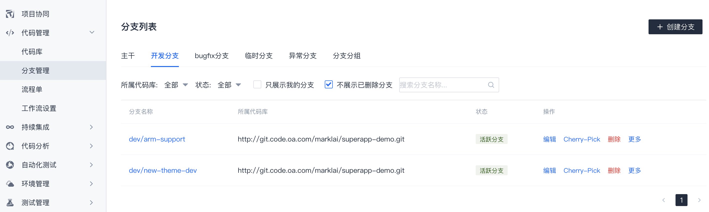
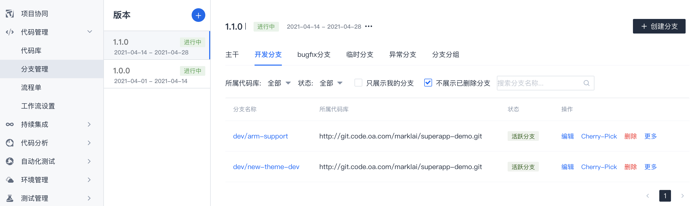
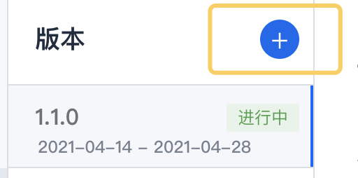
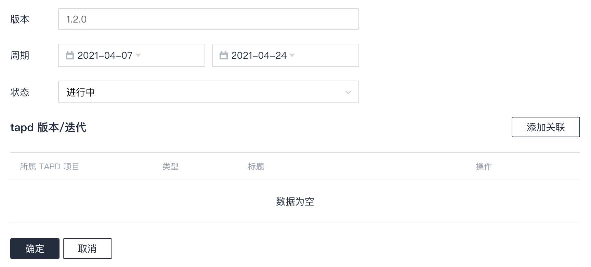
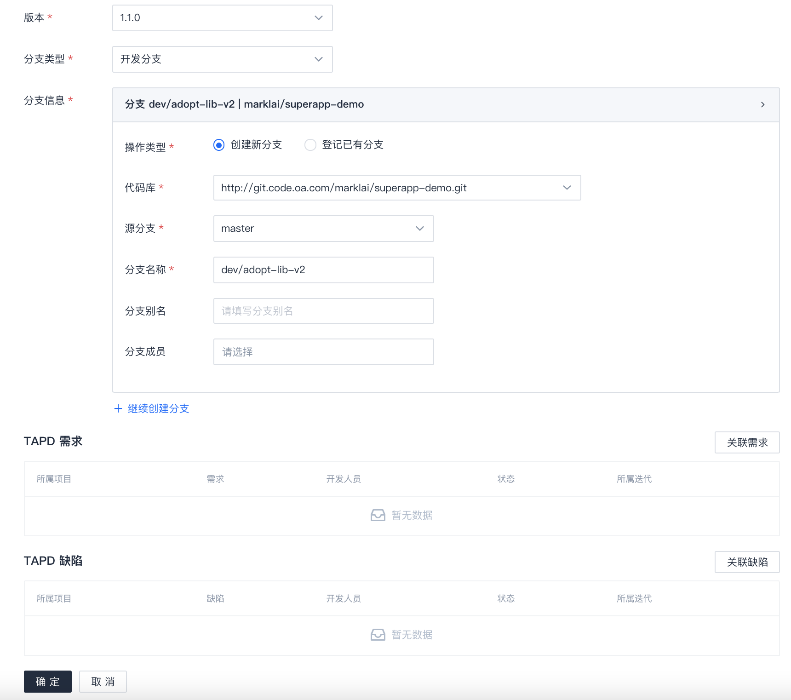
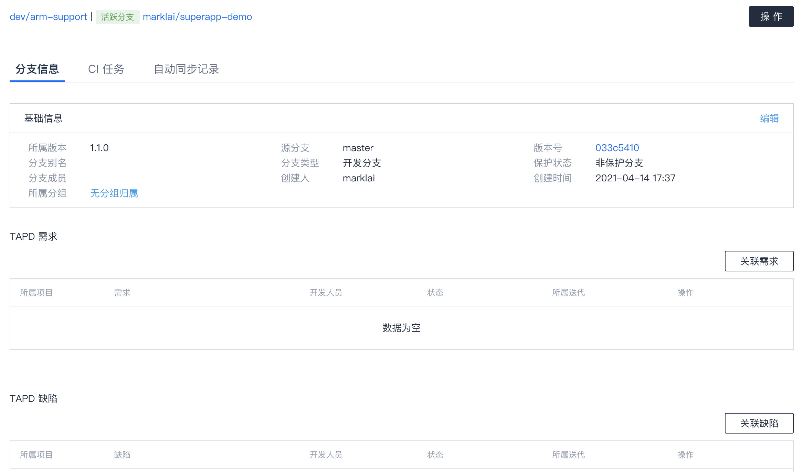

# 分支管理

## 分支列表介绍
取决于管理员是否开启`分支版本管理`，`分支管理`列表展示有所不同。  

当没有开启`分支版本管理`时：

当开启`分支版本管理`时：

## 管理版本
适用于管理员开启了`分支版本管理`的情形，如未开启则没有版本的概念。  

### 添加版本
点击 "版本" 栏处的 `+` 按钮添加版本。  

填写相关信息：
* 版本：分支版本名称，如`1.0.0`、`1.1.0`。
* 周期：计划的周期。
* 状态：标记状态。
* TAPD版本/迭代：非必填。可以绑定TAPD项目的版本或迭代，绑定后，分支详情中点击关联TAPD单时将展示绑定版本/迭代的需求单和bug单。  
    > 该选项有个前提条件，需要在`项目协同`中关联TAPD项目，有关操作请参考 [帮助中心](http://help.coding.pages.oa.com/) 中`项目协同`内容。

### 编辑/删除版本
点击 "版本" 栏下方 `查看所有版本`，在具体版本右侧操作 `编辑`或`删除`。

**尽量避免删除版本，因为删除后，原属于该版本的分支将变成无版本归属状态。**

## 新建分支
一般开发人员只本地创建分支后push到远端，并不需要到`分支管理`页面来新建。  

`分支管理`页面新建分支操作如下。
点击界面上的 `创建分支` 按钮，填写分支信息，点击 `确定` 创建。

* 版本：分支归属于哪个版本。（未开启分支版本管理时不出现该选项）
* 分支类型：要新建哪种分支。
* 操作类型：常用的是`创建新分支`。如果有旧分支要录入，可以选择`登记已有分支`。
* 代码库：即在哪个代码库中新建分支。
* 源分支：基于哪条分支的最新提交来创建新分支。
* 分支名称：顾名思义，但要注意符合分支类型命名规则。
* 分支别名：别名注释，非必填。
* 分支成员：非必填，较少用，对于保护分支才有意义。
* `+ 继续创建分支`：支持一次创建多条分支。
* TAPD需求：新分支关联TAPD需求单，非必填。
* TAPD缺陷单：新分支关联TAPD bug单，非必填。

## 查看分支
在`分支管理`页面，点击具体分支的名称可以进入分支详情。分支详情中可以查看分支基本信息、关联TAPD单、查看关联的CI流水线、自动同步的记录等。  

## 删除分支
在`分支管理`页面，点击具体分支右侧的 `删除` 可以删除分支。

**请注意！删除分支将真正地从代码库中删除分支，删除之前请务必确认分支已不再需要。**

## 关于异常分支
在`分支管理`页面，分支分类中有一个特殊分类 `异常分支`，不符合命名规范或缺少必须绑定的TAPD单的分支将出现在这里。  
点击分支名称可以查看其详情或补充信息。  

