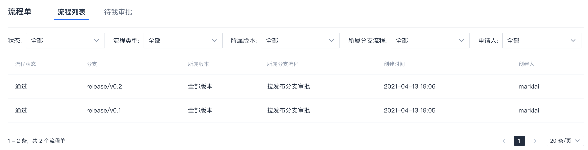

# 流程单

如果项目管理员配置了分支流程，则相关流程记录将出现在 `代码管理`/`流程单` 页面中。  

## 查看所有流程单
打开`代码管理`/`流程单`后，默认显示的是所有流程记录。  

> 如果管理员没有配置分支流程，则此处列表为空。

点击具体的一条记录可以查看详情。

## 查看需要自己审批的流程单
切换到 `待我审批` 可以查看需要自己审批的流程单，点击流程单右侧 `前往审批` 进入审批界面。  

