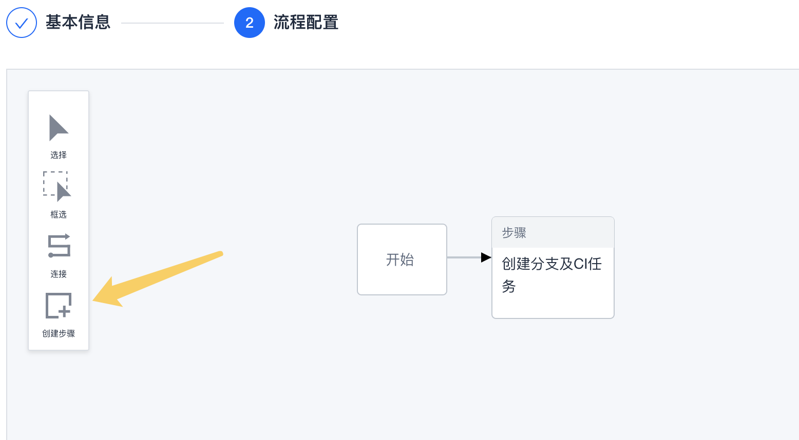
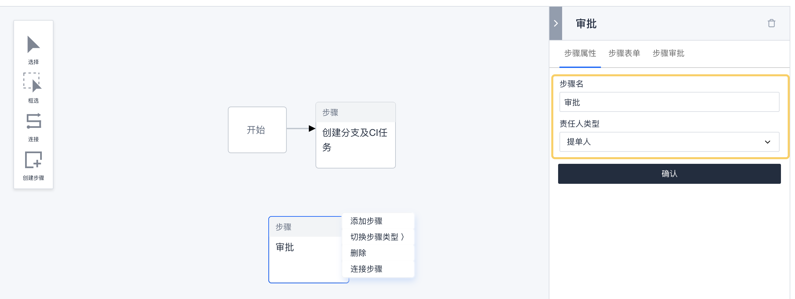
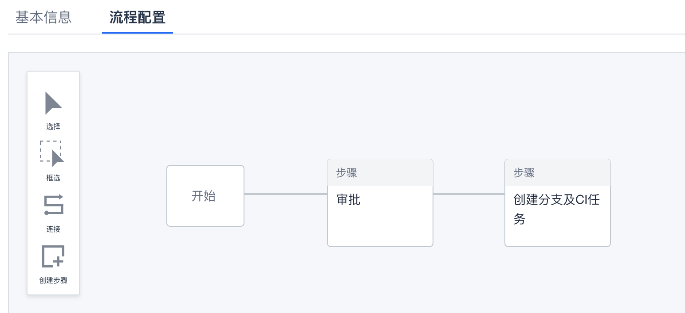
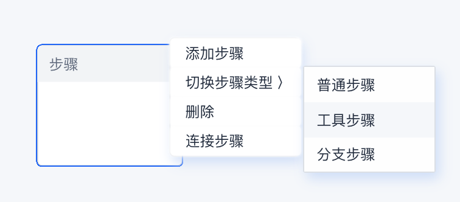
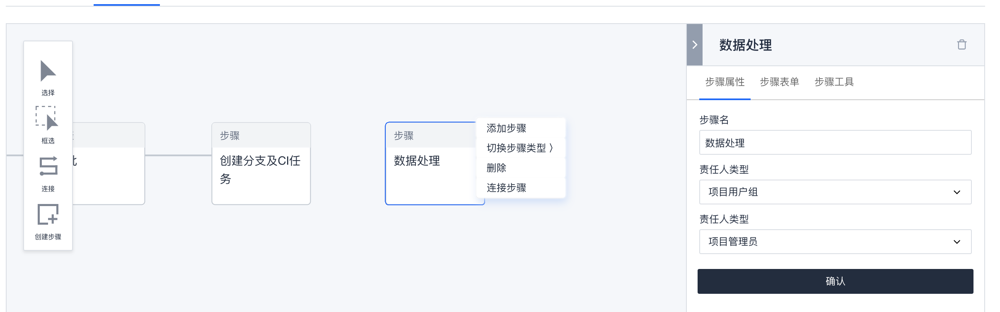
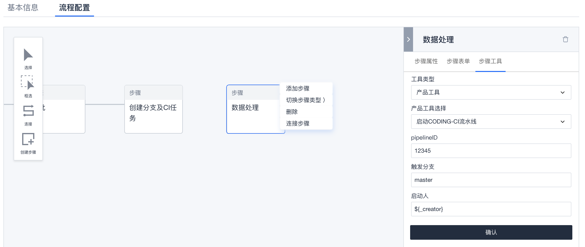
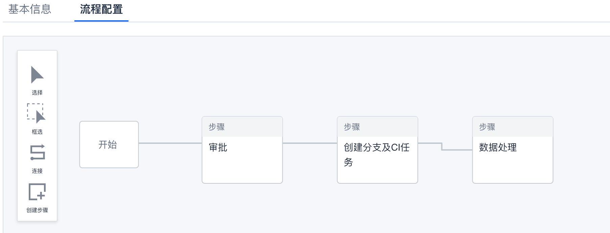
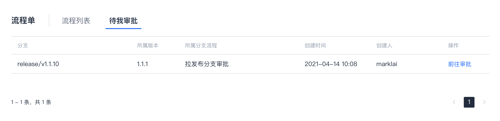
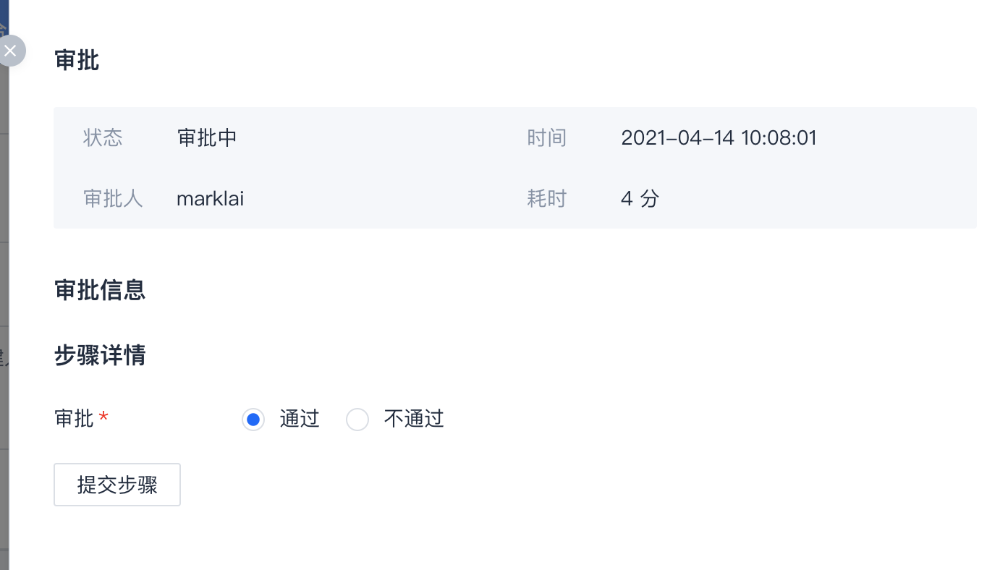
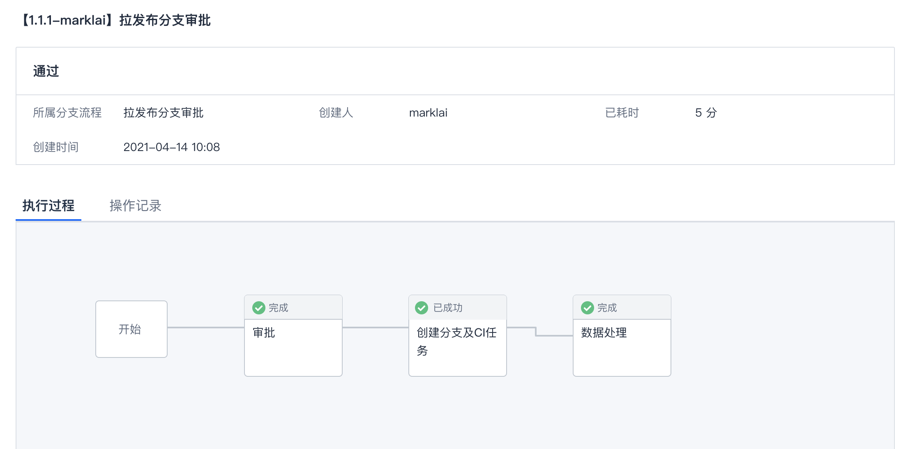

# 流程设置

`流程设置` 允许项目团队在必要的时候为分支拉取或合流过程增加一些自定义环节，例如审批或者触发特殊流水线等，以满足团队的相关管控要求。

> 注：该模块目前仅支持增加审批和触发Coding流水线，其他功能需谨慎使用。

以下通过示例来说明添加审批和触发流水线是怎样设置的。  

## 添加/编辑流程
点击`流程设置`右上方的 `+ 分支流程` 可以添加流程；如果要编辑现有流程，则点击已有流程右侧的 `编辑` 按钮。  

### 基本信息
* 流程名称：填写易于表达用途的名称
* 流程类型：该流程在分支创建时或者特定类型分支发起MR时执行
* 目标分支类型：对于 `拉取` 的流程，此处指拉出该类型的分支时执行流程；对于 `合入` 的流程，此处指出现往该类型分支发起的MR时执行流程。  

### 流程配置
起初存在的是系统内置的步骤，例如 "开始"、"创建分支及CI任务"，其内容不可变，但可以在其前后适当添加一些步骤。  
可以点击 `创建步骤` 来添加一个新步骤，这次我们将在创建分支之前添加一个审批环节。  

刚创建的步骤默认是作审批用的，我们只需要其属性中填写步骤名称和责任人类型（即谁来审批）。  
审批人可以选择 OA角色（如直属leader）、Coding项目角色（如项目管理员）、提单人、具体人名，根据需要设置。  

点击`开始`和`创建分支及CI任务`之间的连线，删除该连线。  
然后点击左侧工具栏的`连接`，从`开始`步骤拖动到`审批`步骤，建立一条`开始`到`审批`的连线。执行相同的操作，建立一条`审批`到`创建分支及CI任务`的连线。 

然后点击`保存`，到这里我们就为创建分支添加了一个前置审批步骤。 

其结果如下所示：  

如果我们需要的只是添加审批环节，那么配置到此就结束了。  
作为演示目的，我们再为该流程最后添加一个触发流水线的步骤，例如触发一个专门用于数据收集的流水线。  

点击 `创建步骤` 添加一个新步骤，不过这里我们再切换步骤类型为`工具步骤`。

属性设置处填写步骤名称以及责任人类型，此处责任人不需要审批，一般可选提单人或项目管理员。  

在步骤工具处，工具选择`启动CODING-CI流水线`，然后填写流水线ID，其他选项一般不用改动，然后点击`确认`。    

点击左侧工具栏的`连接`，建立一条`创建分支及CI任务`到`数据处理`（示例工具步骤）的连线。  
然后点击流程配置界面下方的`保存`。

至此，我们为拉`发布分支`的流程添加了一个前置审批步骤以及一个后置数据处理步骤。其结果如下所示：

如果想为MR合入的流程添加一下额外步骤，操作跟上述类似，按需添加步骤并调整步骤间关系就可以了。

## 效果示例
当相关类型有新分支创建时，流程审批人会收到类似如下的企业微信消息提醒，可以点击链接进入审批。  
除此之外，也可以在`代码管理`/`流程单`处找到`待我审批`的记录。  

> 如果分支是先创建后push到工蜂的，则在审批通过前分支将被锁定（设为保护分支并清理权限）

审批时可以决定是否通过，如不通过则流程结束。  

审批通过后流程将按设定的步骤往下执行，例如：

