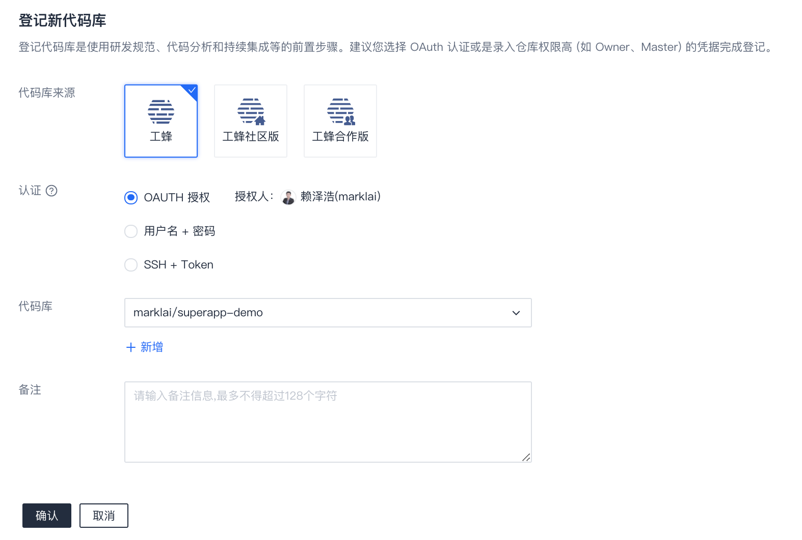
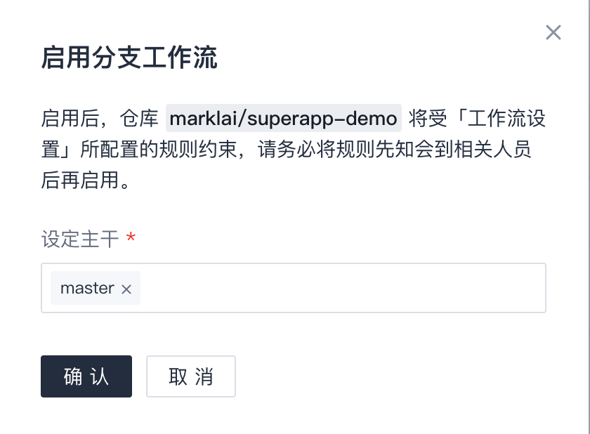

# 代码库
主要功能涉及代码库及凭证的登记管理、代码库详情查看、开启或取消分支工作流等。  

> 行文中可能会用到术语 [代码库]、[仓库]，在`代码管理`中，两者意义等同。

## 登记仓库
登记仓库是使用分支工作流、代码分析、持续集成等功能的前置步骤，一处登记，多处使用，避免重复登记或导入的操作。

已支持的仓库来源：
* 工蜂内网 (git.code.oa.com)
* 工蜂社区版 (git.code.tencent.com)
* 工蜂合作版 (git.tencent.com)

操作过程：  
进入Coding项目后，点击左侧`代码管理`/`代码库`，点击`+ 登记代码库`。

* 来源：选择目标仓库类型，目前多数是`工蜂`。
* 认证：为避免密码过期造成影响，建议您尽量选择`OAuth`认证；根据实际需要也可以采用 [用户名+密码] 或 [SSH+Token] 的认证方式。  
    考虑到仓库可能会使用到分支工作流，或者在持续集成中设置仓库事件触发，建议用权限较高的身份（如 Master 或 Owner）来完成登记。
* 代码库：选择仓库或粘贴仓库URL。通过点击 `+ 新增` 可以一次性登记多个仓库。

点击`确认`完成登记。

## 删除仓库登记
在`代码库`列表，点击仓库右则的`删除`按钮，即可删除仓库登记。此处删除的是登记的记录，不会真正删除仓库。

**请注意！删除仓库登记后，所有用到该登记信息的任务都将缺少认证而失败！** 因此，在删除之前请务必谨慎确认清楚。

## 为仓库启用或取消`分支工作流`
我们可以为具体仓库启用`分支工作流`，启用后，该仓库将受`分支工作流`相关规则管控。建议将`分支工作流`相关规则提前告知团队成员，然后再对仓库启用`分支工作流`，避免沟通不及时带来影响。    

如果确认某仓库要启用`分支工作流`，可以在`代码管理`/`代码库`界面中`分支工作流`一列进行启用。  

启用分支工作流的同时需指定仓库的主干，主干信息在后续有特别用途，如在`分支管理`中跨越多版本、作为界面上拉分支的源分支等。

如果您看到以下提示，说明当前项目还没有配置好`分支工作流`相关规则，请先参考 [分支规则设置] 做好相关设置。  

## 查看仓库详情
在`代码库`列表，点击仓库名称或右侧编辑按钮可以进入仓库详情页。  

在详情页中可以查看仓库的基础信息、分支工作流的启用情况、认证信息等，在此处也可以启用/取消分支工作流，管理认证信息。

## 管理认证信息
在仓库详情页中可以新增、编辑或删除认证信息。  

需要注意的是，某些变更可能会导致现有任务失败，例如删除了认证或更改为权限更小的身份。  
