# 快速接入
本文通过一个典型的场景来向大家快速展示`代码管理`基本功能的使用。

> 示例：我们有个后端项目（Python语言），希望借助`代码管理`建立团队的分支工作流，拉分支时自动创建CI流水线，开发分支每日自动从父分支同步代码，分支合流后过一段时间自动删除。

> 行文中可能会用到术语 [代码库]、[仓库]，在`代码管理`中，两者意义等同。

## 登记代码库
进入Coding项目后，点击左侧`代码管理`/`代码库`，点击`+ 登记代码库`。
来源选择`工蜂`，采用OAuth认证，选择目标代码库之后点击`确认`。

> 注：因为后续`分支工作流`设置涉及代码库管理和webhook注册等，认证的身份需要是 Master 或 Owner。
另外，如果只是为了登记后其他功能模块（如代码分析）能够拉到代码，那么到这一步就行了，后续步骤不用进行，并且认证身份可以不用有管理权限。

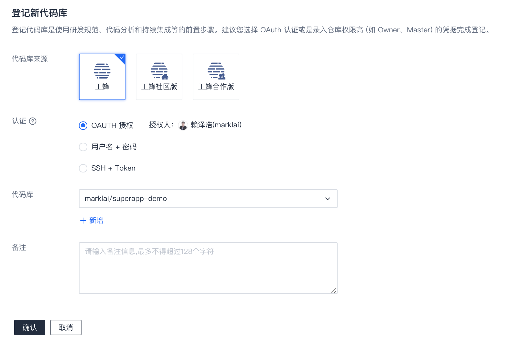

## 设置分支工作流
### 初始化Git工作流
点击`代码管理`/`工作流设置`，未设置过分支工作流的项目会看到预设Git工作流的介绍，已设置过的则会看到相关设置项。  

`代码管理`内置了业界常见的一些Git工作流，如GitHub工作流、GitLab工作流（分为持续发布和版本发布两类）等，定义了相关分支类型及命名规则、关联TAPD单的要求、自动同步的设定、MR约束规则等，可通过查看详情了解更多细节。  

用户可以选择以内置工作流进行初始化，也可以选择自定义设置，根据需要添加规则。  
这里我们采用自定义设置。
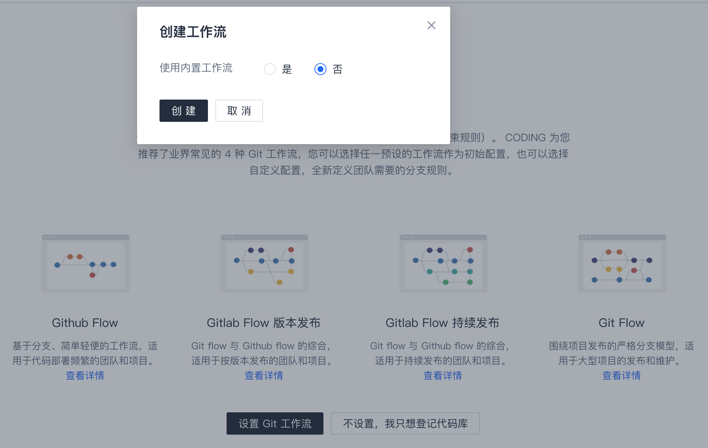

### 查看/设置分支规则
* **【分支类型】**
    点击`代码管理`/`工作流设置`，在`分支规则`页面可以查看、编辑、增加或删除分支类型。
    分支命名规则支持正则表达式（如 `dev/.*`）。

    > `主干`是个特殊的类型，不可编辑，并且不在此处指定名称，以代码仓库启用分支工作流时指定的主干为准。

    最终我们的分支类型如下所示，我们划分了"开发分支"、"bugfix分支"、"临时分支"。
    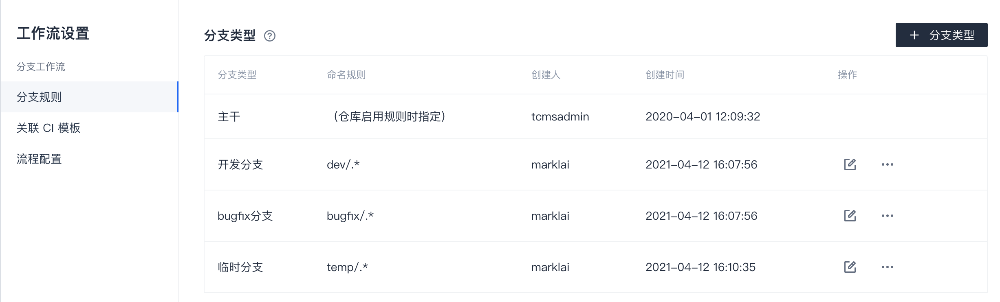

    通过编辑可以细化具体分支类型的设置，如新建分支时是否为保护分支、是否要求绑定TAPD单、是否启用一些辅助自动工具等。  

    请注意，如果要求分支绑定TAPD单，则需要在`项目协同`中关联TAPD项目，有关操作请参考 [帮助中心](http://help.coding.pages.oa.com/) 中`项目协同`内容。
    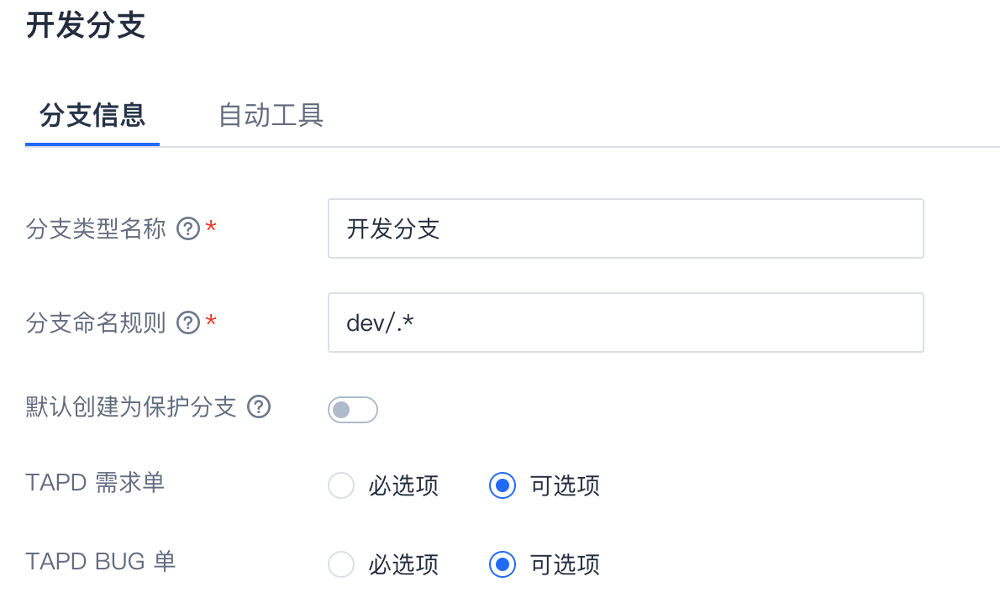

    某些类型我们选择启用辅助工具进行每日同步以及合流后自动删除。  
    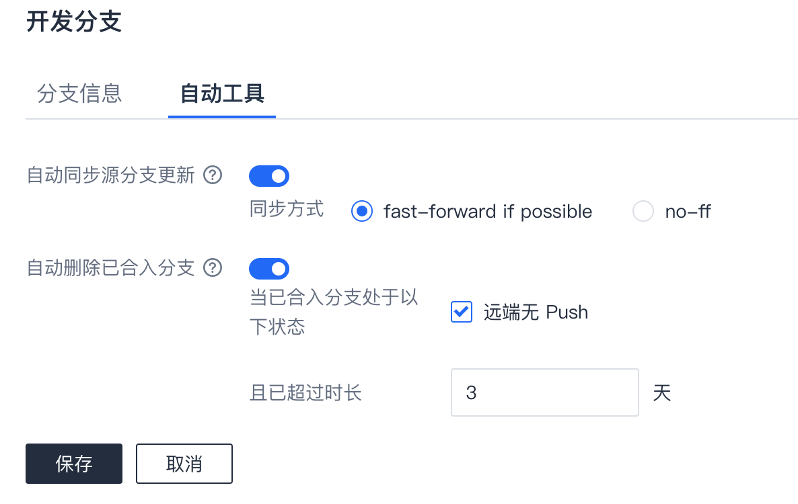

* **【MR约束】**
    `MR约束`作用是限制哪些类型的分支允许合入目标分支，不符合规则的 MR 将被自动阻塞。  

    `MR约束`并不总是必须的，但假如项目团队想做更细致的规范，该功能就可以派上用场。  

    例如，我们允许`开发分支`和`bugfix分支`合入主干，而预研性质的`临时分支`则不允许，那么我们可以设置这样的`MR约束`规则。
    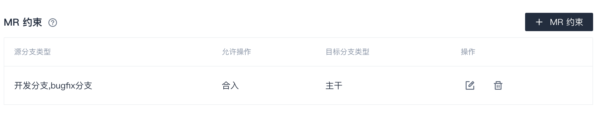
    
    > 请注意，假如您要设置`MR约束`，则请把 **所有** 允许的规则都列上，避免规则不全导致意外的阻塞。例如，假设`bugfix分支`除了合入主干，还可能往`开发分支`发起MR，则我们还需要添加一条允许`bugfix分支`合入`开发分支`的约束规则。

### 关联CI模板
关联CI模板是建立分支类型与流水线模板的关联，实现拉分支时能够自动创建相关的持续集成流水线，并将流水线信息记录到分支信息中（在`分支管理`页面可查看）。  
该步骤并不是必须的，如果当前项目没这方面需求，可以不设置。  

作为建立关联的前提之一，您需要有相应的流水线模板，如果还没有，则需要先创建，可参考 [持续集成相关的手册](http://help.coding.pages.oa.com/docs/ci/%E4%BD%BF%E7%94%A8%E6%89%8B%E5%86%8C/%E6%B5%81%E6%B0%B4%E7%BA%BF%E6%A8%A1%E6%9D%BF/pipeline-template.html)。

这里我们来新建一个CI模板的关联。  
部分选项说明：  
  - 选择仓库：对所有启用分支工作流的仓库生效还是只对部分仓库生效。  
  - 适用版本范围：一般选择"所有版本"。
  - 覆盖分支类型：即哪些分支新建后创建流水线，这里我们选`开发分支`和`bugfix分支`。
  - 创建方式：选"已有CI模板配置"，并选择目标流水线模板。
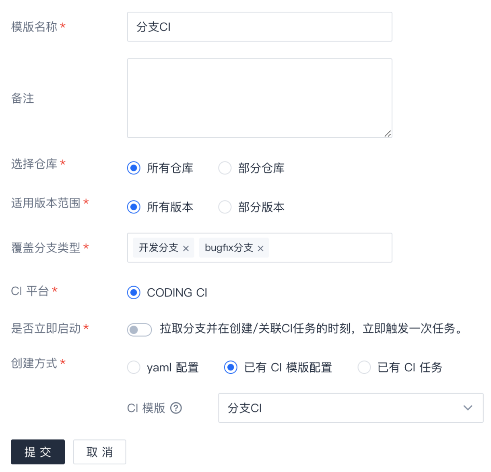

## 目标代码库启用`分支工作流`
经过前面的环节，我们已经登记了代码仓库，配置好了`分支工作流`相关规则。  

到目前为止，`分支工作流`对代码库不会带来任何影响。这是预期中的，因为有些代码库只是为了登记凭证以便访问代码，并不想受该项目的`分支工作流`管控。  

如果我们确认某代码库要启用`分支工作流`管控，可以在`代码管理`/`代码库`界面中启用。  

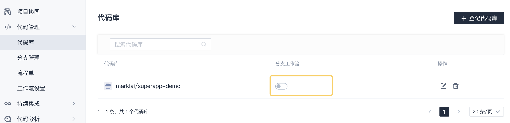

指定代码库的主干信息，点击`确认`。
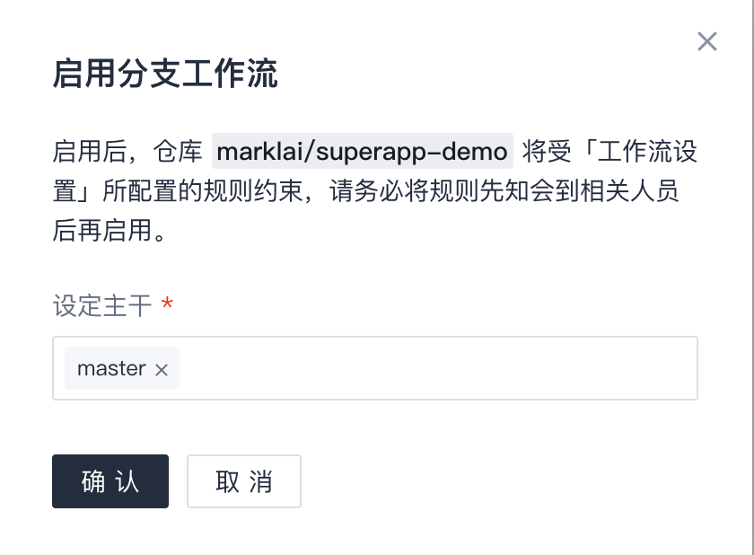

## 效果示例
### 拉分支自动创建流水线
当创建符合命名规范的分支时，例如本地创建分支后push到工蜂，`代码管理`/`分支管理`中将自动划归分支类型，并创建CI流水线，流水线信息可在分支详情中查看。

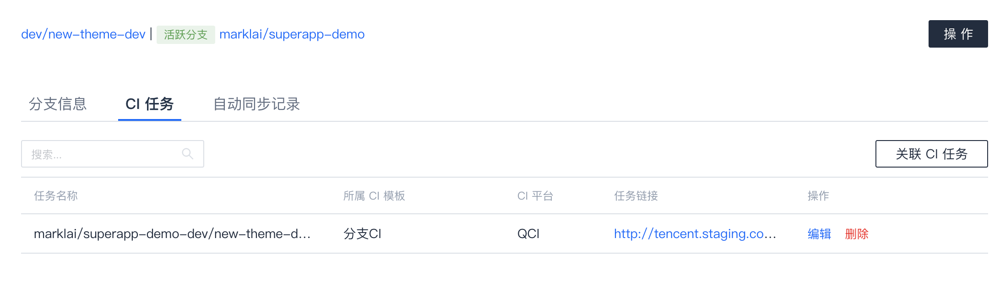

### 不符合规则的分支被锁定
当创建的分支不符合分支规则时，分支将被锁定并归为"异常分支"，相关开发将收到邮件和企业微信提示，根据提示进行改正。

常见的原因及应对方式：
* 分支命名不符合规范：重新创建符合规范的分支。
* 分支未绑定TAPD需求或bug单：在分支详情中关联TAPD需求或bug单，之后分支自动变成正常状态。

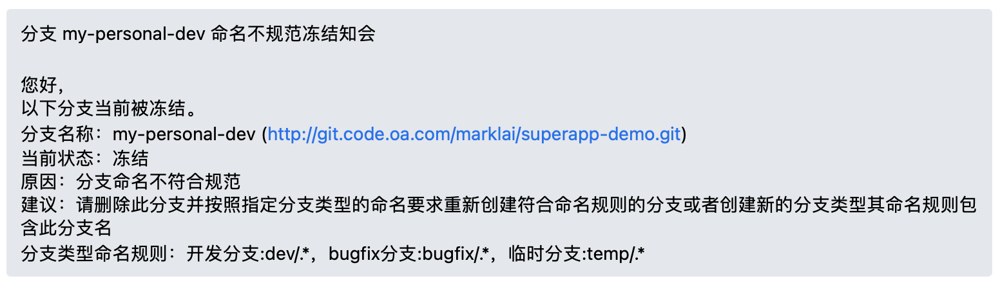

### 未被允许的分支类型往主干MR时被阻塞
例如`临时分支`不在允许的`MR约束`之列，当`临时分支`向主干发起MR时，该MR将被自动阻塞。

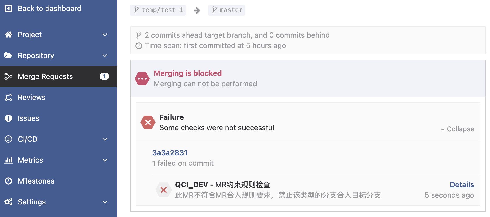

