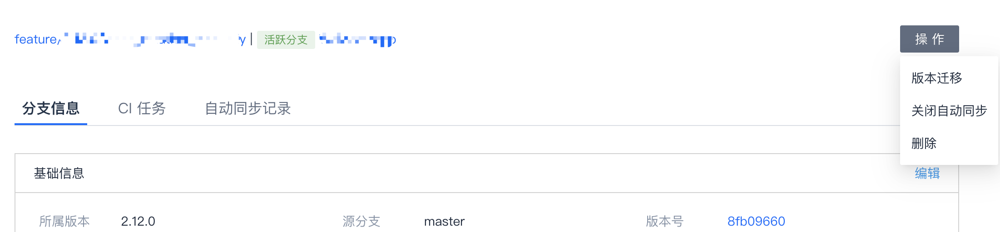

**【常见问题】**
[toc]

### 登记代码库一定要用Master或Owner身份吗？
不一定，取决于项目对代码库的使用方式。如果后续会用到代码库管理权限，例如启用`分支工作流`、CI流水线监听代码推送或MR事件等，需要管理分支或者注册webhook，就需要Master或Owner权限；如果只是为了能够拉到代码，例如代码分析或流水线拉代码插件，那么Developer或Reporter权限就足够。

### 所有登记的代码库都会受`分支工作流`的管控吗？
登记的代码库默认不会受到`分支工作流`相关规则的管控，只有明确地为具体代码库启用`分支工作流`之后，该代码库才会受管控。

### 项目一定要用`分支工作流`吗？
不一定，如果项目并没有用到诸如分支命名规范、拉分支自动创建流水线、MR约束、分支与TAPD强绑定、分支自动删除等等`分支工作流`相关功能，可以不用`分支工作流`，只用代码库登记功能就可以了。

### 初始化Git工作流时选了内置工作流，还能修改吗？
可以修改。  
内置Git工作流（例如`GitHub工作流`、`GitLab工作流`等）是按照业界常见的实践预先定义了一系列分支规则，但这些规则并不是不能改变的。初始化之后，项目管理员仍然可以进行规则增删改，直到符合实际需要。

### 一定要在`分支管理`界面上拉分支吗？
不一定。界面上拉分支只是平台提供的一种方式，但实际上开发同学可以保持原有的本地拉分支、再推送到远端的习惯。（分支注意要符合项目管理员定义的规则，如不符合则分支会被锁定并知会分支负责人）

### 分支规则要求绑定TAPD单，是不是只能在`分支管理`的分支详情里绑定？
分支详情里绑定需求单或bug单只是若干操作方式之一。  
如果是本地拉的分支，可以在commit日志里添加如 `--story=TAPDID` 或 `--bug=TAPDID`，push后将自动将分支与相关需求/bug单绑定。（例如 `--story=123456789`）
另外，如果分支因缺少绑定需求单而被锁定，除了到分支详情里绑定，还可以在TAPD需求里绑定分支，绑定后分支将自动恢复活跃状态。  

### 分支自动同步的辅助工具是否支持自定义频率？
目前不支持自定义，固定为每日同步。

### 分支类型启用了自动同步，但某个分支想暂停该功能，该怎么做？
可以打开分支详情，在操作选项中选择 `关闭自动同步`。

